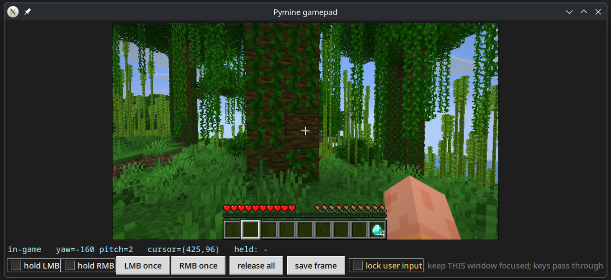

# Pymine — Minecraft API Controller for Self Learning Models 

A client-side Fabric mod that exposes Minecraft over a localhost HTTP API for self-learning agents, plus a zero-dependency Python client. The agent sees the world through screenshots (`mc.getframe()`) and acts through the same input paths a human would, so vanilla mechanics (slot clicks, drags, sprint, mining) behave exactly as normal. The idea is simply that normalized logits can easily drive game mechanics.

